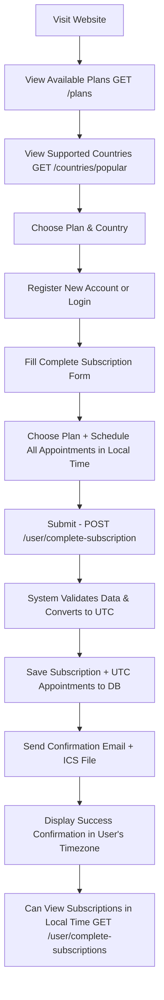

# 🎯 Appointment Booking System

Simple and direct appointment booking system - users choose a plan and book all appointments in a single form with full timezone support!

## 🚀 Technologies Used

- **Backend:** Node.js, Express.js
- **Database:** MongoDB with Mongoose
- **Authentication:** JWT Token
- **Email:** Nodemailer with ICS Calendar files
- **Validation:** Express Validator
- **Timezone Handling:** Luxon library with IANA timezone support
- **Global Support:** 100+ countries with automatic timezone conversion

## 📁 Simplified Project Structure

```
src/
├── controllers/
│   ├── subscriptionController.js      # User subscriptions (timezone-aware)
│   ├── adminSubscriptionController.js # Admin subscription management
│   ├── planController.js              # Plan management
│   ├── authController.js              # User authentication
│   ├── adminController.js             # Admin authentication
│   ├── publicController.js            # Public plan display
│   ├── sessionsController.js          # Session management (timezone-aware)
│   └── countriesController.js         # Countries and timezone API
├── models/
│   ├── subscriptionModel.js           # Subscription model (UTC storage)
│   ├── planModel.js                   # Plan model
│   ├── userModel.js                   # User model (with country support)
│   └── adminModel.js                  # Admin model
├── routes/
│   ├── userRoute.js                   # User routes
│   ├── adminRoute.js                  # Admin routes
│   ├── authRoute.js                   # Authentication routes
│   ├── sessionsRoute.js               # Session routes
│   ├── countriesRoute.js              # Countries API routes
│   └── indexRoute.js                  # Main routes
├── utils/
│   ├── timezoneUtils.js               # Timezone conversion utilities
│   ├── countryTimezone.js             # Country to timezone mapping
│   └── validators/
│       ├── subscriptionValidators.js  # Subscription validation
│       ├── planValidators.js          # Plan validation
│       ├── authValidators.js          # Authentication validation
│       └── adminValidators.js         # Admin data validation
└── TIMEZONE_SYSTEM.md                 # Comprehensive timezone documentation
```

## 🌍 Timezone-Aware Booking System

### Key Features:

- **UTC Storage**: All appointment times stored in UTC in database for consistency
- **Local Display**: Times shown in user's local timezone based on their country
- **Global Support**: Works with 100+ countries automatically
- **DST Handling**: Automatic daylight saving time adjustments
- **Admin Flexibility**: Admins can view appointments in any timezone
- **Accurate Conversion**: Uses Luxon library with IANA timezone database

### How It Works:

1. **User Input**: User enters appointment time in their local timezone
2. **Storage**: System converts to UTC and stores in database
3. **Display**: System converts back to user's timezone for display
4. **Consistency**: All users see appointments in their own timezone

### Supported Countries API:

```http
GET /api/v1/countries              # All supported countries
GET /api/v1/countries/popular      # Popular countries list
GET /api/v1/countries/:country/timezone  # Get country timezone
```

---

## ⚙️ Environment Setup (.env)

```env
PORT=4000
NODE_ENV=development

# Database
MONGODB_URL=mongodb://localhost:27017/AppointmentBookingSystem

# JWT Configuration
JWT_SECRET_KEY=your_very_long_and_secure_secret_key_here

# Email Configuration
EMAIL_HOST=smtp.gmail.com
EMAIL_PORT=587
EMAIL_USER=your_email@gmail.com
EMAIL_PASSWORD=your_app_password
EMAIL_FROM="Appointment Booking <your_email@gmail.com>"
```

## 🏃‍♂️ Running the Project

```bash
# Development
npm run start:dev

# Production
npm run start:prod
```

## 🎯 Simplified System

### For Regular Users:

1. **View available plans** (no login required)
2. **Register new account** or login
3. **Fill out one form only** - choose plan + all appointments
4. **Receive confirmation email** with calendar file
5. **View their subscriptions**

### For Admin:

1. **Create and manage plans**
2. **Monitor all subscriptions**
3. **View statistics**

---

## 📋 API Endpoints

### 🔓 Public (no login required)

```http
GET /api/v1/plans
GET /api/v1/countries              # Get supported countries
GET /api/v1/countries/popular      # Get popular countries
```

Display all available plans for selection and supported countries

**Response:**

```json
{
  "status": "SUCCESS",
  "results": 3,
  "data": {
    "plans": [
      {
        "_id": "674b123...",
        "name": "Basic Plan",
        "description": "4 sessions per month",
        "sessionsPerMonth": 4,
        "sessionsPerWeek": 2,
        "price": 500,
        "currency": "EGP",
        "duration": 30
      }
    ]
  }
}
```

### Countries API Response:

```json
{
  "status": "SUCCESS",
  "results": 15,
  "data": {
    "popularCountries": [
      {
        "name": "United States",
        "timezone": "America/New_York",
        "timezoneDisplay": "America/New York"
      },
      {
        "name": "United Kingdom",
        "timezone": "Europe/London",
        "timezoneDisplay": "Europe/London"
      },
      {
        "name": "Saudi Arabia",
        "timezone": "Asia/Riyadh",
        "timezoneDisplay": "Asia/Riyadh"
      }
    ]
  }
}
```

---

## 👤 Regular User

### 1. Authentication

```http
# Step 1: Send OTP to email for verification (no user created in DB yet)
POST /api/v1/auth/send-otp
Content-Type: application/json

{
  "email": "ahmed@example.com"
}
```

```http
# Step 2: Verify OTP (user created in DB only after successful verification)
POST /api/v1/auth/verify-otp
Content-Type: application/json

{
  "email": "ahmed@example.com",
  "otp": "123456"
}
```

```http
# Step 3: Complete registration with personal details
POST /api/v1/auth/complete-registration
Authorization: Bearer TEMP_TOKEN
Content-Type: application/json

{
  "firstName": "Ahmed",
  "lastName": "Mohamed",
  "phone": "+201234567890",
  "gender": "Male",
  "country": "Egypt"
}
```

```http
# Login (for existing users)
POST /api/v1/auth/login/send-otp
Content-Type: application/json

{
  "email": "ahmed@example.com"
}
```

**Response:**

```json
{
  "status": "SUCCESS",
  "message": "Login successful",
  "data": {
    "token": "eyJhbGciOiJIUzI1NiIsInR5cCI6IkpXVCJ9...",
    "user": {
      "id": "674b...",
      "name": "Ahmed Mohamed",
      "email": "ahmed@example.com"
    }
  }
}
```

### 2. Create Complete Subscription (Timezone-Aware)

**Important**: All times should be entered in the user's local timezone. The system will automatically convert to UTC for storage.

```http
POST /api/v1/user/complete-subscription
Authorization: Bearer YOUR_TOKEN
Content-Type: application/json

{
  "subscriptionPlanId": "674b1234567890abcdef1234",
  "startDate": "2025-01-15",
  "sessions": [
    {
      "date": "2025-01-15",
      "time": "14:30",
      "notes": "First session - user's local time"
    },
    {
      "date": "2025-01-17",
      "time": "16:00",
      "notes": "Second session - user's local time"
    },
    {
      "date": "2025-01-22",
      "time": "14:30"
    },
    {
      "date": "2025-01-24",
      "time": "16:00"
    }
  ]
}
```

**Note**: The user's country is automatically taken from their profile for timezone conversion.

**Response:**

```json
{
  "status": "SUCCESS",
  "message": "Subscription created successfully with all appointments",
  "data": {
    "subscription": {
      "id": "674b5678901234567890abcd",
      "planName": "Basic Plan",
      "planPrice": 500,
      "planCurrency": "EGP",
      "startDate": "2025-01-15T00:00:00.000Z",
      "endDate": "2025-02-14T00:00:00.000Z",
      "totalSessions": 4,
      "sessionsScheduled": 4,
      "status": "confirmed",
      "nextSession": {
        "date": "2025-01-15",
        "time": "14:30",
        "startsAtUTC": "2025-01-15T19:30:00.000Z",
        "displayTime": "15/01/2025 14:30",
        "timezone": "America/New_York"
      },
      "sessions": [
        {
          "id": "674b567890123456789",
          "date": "2025-01-15",
          "time": "14:30",
          "startsAtUTC": "2025-01-15T19:30:00.000Z",
          "displayTime": "15/01/2025 14:30",
          "timezone": "America/New_York",
          "status": "scheduled",
          "notes": "First session"
        }
        // Rest of sessions...
      ],
      "displayCountry": "United States"
    }
  }
}
```

### 3. View User Subscriptions (Timezone-Aware)

```http
GET /api/v1/user/complete-subscriptions
Authorization: Bearer YOUR_TOKEN

# Optional: View in different timezone
GET /api/v1/user/complete-subscriptions?displayCountry=Japan
```

**Response:**

```json
{
  "status": "SUCCESS",
  "results": 2,
  "data": {
    "subscriptions": [
      {
        "id": "674b5678901234567890abcd",
        "planName": "Basic Plan",
        "planPrice": 500,
        "planCurrency": "EGP",
        "startDate": "2025-01-15T00:00:00.000Z",
        "endDate": "2025-02-14T00:00:00.000Z",
        "totalSessions": 4,
        "sessionsCompleted": 1,
        "sessionsRemaining": 3,
        "status": "confirmed",
        "nextSession": {
          "date": "2025-01-17",
          "time": "16:00",
          "displayTime": "17/01/2025 16:00",
          "timezone": "America/New_York"
        },
        "createdAt": "2025-01-10T10:30:00.000Z",
        "sessions": [
          {
            "id": "674b567890123456789",
            "date": "2025-01-15",
            "time": "14:30",
            "startsAtUTC": "2025-01-15T19:30:00.000Z",
            "displayTime": "15/01/2025 14:30",
            "timezone": "America/New_York",
            "status": "completed",
            "notes": "First session"
          },
          {
            "id": "674b567890123456790",
            "date": "2025-01-17",
            "time": "16:00",
            "startsAtUTC": "2025-01-17T21:00:00.000Z",
            "displayTime": "17/01/2025 16:00",
            "timezone": "America/New_York",
            "status": "scheduled",
            "notes": "Second session"
          }
          // All sessions with timezone conversion
        ],
        "displayCountry": "United States"
      }
    ]
  }
}
```

### 4. Get Available Time Slots (Timezone-Aware)

```http
GET /api/v1/sessions/available?startDate=2025-01-20&displayCountry=United%20States
Authorization: Bearer YOUR_TOKEN
```

### 5. Get Booked Sessions (Timezone-Aware)

```http
GET /api/v1/sessions/booked?displayCountry=United%20States
Authorization: Bearer YOUR_TOKEN
```

---

## 👑 Admin

### 1. Admin Login

```http
POST /api/v1/admin/login
Content-Type: application/json

{
  "email": "admin@example.com",
  "password": "admin123"
}
```

### 2. Create New Plan

```http
POST /api/v1/admin/subscription-plans
Authorization: Bearer ADMIN_TOKEN
Content-Type: application/json

{
  "name": "Premium Plan",
  "description": "8 sessions per month with additional features",
  "sessionsPerMonth": 8,
  "sessionsPerWeek": 3,
  "price": 1000,
  "currency": "EGP",
  "features": ["Individual sessions", "Personal follow-up", "Weekly reports"],
  "duration": 30
}
```

### 3. View All Plans

```http
GET /api/v1/admin/subscription-plans
Authorization: Bearer ADMIN_TOKEN
```

### 4. View All Subscriptions (Admin Timezone Support)

```http
GET /api/v1/admin/complete-subscriptions
Authorization: Bearer ADMIN_TOKEN

# View in specific timezone
GET /api/v1/admin/complete-subscriptions?displayCountry=Japan

# With optional filters:
GET /api/v1/admin/complete-subscriptions?status=confirmed&userEmail=ahmed@example.com&page=1&limit=10
```

### 5. Comprehensive Statistics

```http
GET /api/v1/admin/complete-subscriptions/stats
Authorization: Bearer ADMIN_TOKEN
```

**Response:**

```json
{
  "status": "SUCCESS",
  "data": {
    "totalSubscriptions": 150,
    "statusBreakdown": [
      { "_id": "confirmed", "count": 80 },
      { "_id": "active", "count": 45 },
      { "_id": "completed", "count": 25 }
    ],
    "paymentBreakdown": [
      { "_id": "paid", "count": 120, "totalRevenue": 75000 },
      { "_id": "pending", "count": 30, "totalRevenue": 15000 }
    ],
    "popularPlans": [
      { "_id": "Basic Plan", "count": 90, "totalRevenue": 45000 },
      { "_id": "Premium Plan", "count": 60, "totalRevenue": 60000 }
    ],
    "monthlyTrends": [
      { "_id": { "year": 2025, "month": 1 }, "count": 25, "revenue": 15000 }
    ]
  }
}
```

---

## 🎯 User Flow (Regular User)



## 🛠️ Admin Flow

```mermaid
graph TD
    A[Admin Login] --> B[Dashboard]
    B --> C[Manage Plans]
    B --> D[Monitor Subscriptions]
    B --> E[View Statistics]

    C --> C1[Create New Plan]
    C --> C2[Edit Existing Plan]
    C --> C3[Delete Plan]
    C --> C4[Activate/Deactivate]

    D --> D1[View All Subscriptions (Any Timezone)]
    D --> D2[Filter by Status]
    D --> D3[Search by Email]
    D --> D4[Update Payment Status]
    D --> D5[View Sessions in Different Timezones]

    E --> E1[Total Subscriptions]
    E --> E2[Most Popular Plans]
    E --> E3[Payment Statistics]
    E --> E4[Monthly Trends]
```

---

## ✅ System Features

### 🎯 **For Users:**

- **One form only** - choose plan and book all appointments at once
- **Timezone friendly** - enter times in your local timezone
- **Global support** - works with 100+ countries automatically
- **No complications** - no editing or canceling appointments
- **Instant confirmation** - confirmation email with calendar file (ICS)
- **Full transparency** - view all subscriptions and appointments in your timezone

### 🛠️ **For Admin:**

- **Comprehensive management** - create and edit plans
- **Continuous monitoring** - all subscriptions and appointments
- **Timezone flexibility** - view appointments in any timezone
- **Detailed statistics** - comprehensive numbers and reports
- **Advanced filters** - search and filter by different criteria

### 🔧 **Technically:**

- **Single database** - each subscription in one document
- **UTC storage** - all times stored in UTC for consistency
- **Timezone conversion** - automatic conversion using Luxon
- **Global support** - 100+ countries with IANA timezone data
- **Automatic validation** - of appointment validity and limits
- **High security** - JWT authentication and comprehensive validation
- **Excellent performance** - simplified and efficient structure

---

## 🚀 Getting Started

### 1. Project Setup:

```bash
git clone https://github.com/your-repo/appointment-booking.git
cd appointment-booking
npm install
```

### 2. Environment Setup:

- Copy `.env.example` to `.env`
- Fill in required environment variables

### 3. Run Project:

```bash
npm run start:dev
```

### 4. Test API:

```bash
# View plans
curl http://localhost:4000/api/v1/plans

# View supported countries
curl http://localhost:4000/api/v1/countries/popular

# Register new user
curl -X POST http://localhost:4000/api/v1/auth/send-otp \
  -H "Content-Type: application/json" \
  -d '{"email":"ahmed@example.com"}'
```

---

## 🧪 Testing Examples

### Get Supported Countries:

```bash
curl http://localhost:4000/api/v1/countries/popular
```

### Register New User:

```bash
# Step 1: Send OTP
curl -X POST http://localhost:4000/api/v1/auth/send-otp \
  -H "Content-Type: application/json" \
  -d '{"email": "ahmed@example.com"}'

# Step 2: Verify OTP
curl -X POST http://localhost:4000/api/v1/auth/verify-otp \
  -H "Content-Type: application/json" \
  -d '{"email": "ahmed@example.com", "otp": "123456"}'

# Step 3: Complete registration
curl -X POST http://localhost:4000/api/v1/auth/complete-registration \
  -H "Content-Type: application/json" \
  -H "Authorization: Bearer TEMP_TOKEN" \
  -d '{
    "firstName": "Ahmed",
    "lastName": "Mohamed",
    "phone": "+201234567890",
    "gender": "Male",
    "country": "United States"
  }'
```

### Create Complete Subscription (Timezone-Aware):

```bash
curl -X POST http://localhost:4000/api/v1/user/complete-subscription \
  -H "Content-Type: application/json" \
  -H "Authorization: Bearer YOUR_TOKEN" \
  -d '{
    "subscriptionPlanId": "674b1234567890abcdef1234",
    "startDate": "2025-01-15",
    "sessions": [
      {
        "date": "2025-01-15",
        "time": "14:30",
        "notes": "First session - local time (will be converted to UTC)"
      },
      {
        "date": "2025-01-17",
        "time": "16:00",
        "notes": "Second session - local time"
      },
      {
        "date": "2025-01-22",
        "time": "14:30"
      },
      {
        "date": "2025-01-24",
        "time": "16:00"
      }
    ]
  }'
```

### View User Subscriptions:

```bash
curl -X GET http://localhost:4000/api/v1/user/complete-subscriptions \
  -H "Authorization: Bearer YOUR_TOKEN"
```

### View Available Time Slots:

```bash
curl -X GET "http://localhost:4000/api/v1/sessions/available?startDate=2025-01-20&displayCountry=United%20States" \
  -H "Authorization: Bearer YOUR_TOKEN"
```

### View Booked Sessions:

```bash
curl -X GET "http://localhost:4000/api/v1/sessions/booked?displayCountry=United%20States" \
  -H "Authorization: Bearer YOUR_TOKEN"
```

### For Admin - Create New Plan:

```bash
curl -X POST http://localhost:4000/api/v1/admin/subscription-plans \
  -H "Content-Type: application/json" \
  -H "Authorization: Bearer ADMIN_TOKEN" \
  -d '{
    "name": "Premium Plan",
    "description": "8 sessions per month",
    "sessionsPerMonth": 8,
    "sessionsPerWeek": 3,
    "price": 1000,
    "currency": "EGP"
  }'
```

---

## 📊 Data Models

### Subscription (Timezone-Aware)

```javascript
{
  user: ObjectId,              // User
  userEmail: String,           // User email
  subscriptionPlan: ObjectId,  // Selected plan
  planName: String,            // Plan name
  planPrice: Number,           // Plan price
  planCurrency: String,        // Currency
  startDate: Date,             // Start date
  endDate: Date,               // End date
  totalSessions: Number,       // Total sessions
  sessions: [                  // All sessions
    {
      date: String,            // "2025-01-15" (original user date)
      time: String,            // "14:30" (original user time)
      startsAtUTC: Date,       // UTC time for storage
      status: String,          // scheduled/completed/cancelled
      notes: String            // Notes
    }
  ],
  status: String,              // confirmed/active/completed
  paymentStatus: String,       // pending/paid/failed
  createdAt: Date,
  updatedAt: Date
}
```

### Plan

```javascript
{
  name: String,                // Plan name
  description: String,         // Plan description
  sessionsPerMonth: Number,    // Sessions per month
  sessionsPerWeek: Number,     // Weekly limit
  price: Number,               // Price
  currency: String,            // Currency (EGP/USD/EUR)
  duration: Number,            // Subscription duration in days
  features: [String],          // Features
  isActive: Boolean,           // Active or not
  createdBy: ObjectId,         // Admin who created the plan
  createdAt: Date,
  updatedAt: Date
}
```

### User (Timezone Support)

```javascript
{
  firstName: String,           // First name
  lastName: String,            // Last name
  email: String,               // Email (unique)
  emailVerified: Boolean,      // Email verification status
  phone: String,               // Phone number
  gender: String,              // Male/Female
  country: String,             // User's country (for timezone)
  role: String,                // User/Admin
  timezone: String,            // Virtual property - auto-calculated from country
  createdAt: Date,
  updatedAt: Date
}
```

---

## 🔐 Security and Authentication

### JWT Token:

- Token is generated upon login
- Token valid for 7 days by default
- Must send Token in header: `Authorization: Bearer YOUR_TOKEN`

### Timezone Security:

- All UTC conversions validated server-side
- User country verified against supported countries list
- Timezone manipulation attacks prevented by server validation

### Validation:

- All inputs are validated using express-validator
- Timezone-aware validation of dates and times
- Prevent appointment conflicts with UTC-based checking
- Business hours validation in user's local timezone
- Automatic DST handling

### Error Handling:

- Clear and helpful error messages
- Correct HTTP status codes
- Server error logging

---

## 🌍 Timezone System Testing

### Quick Timezone Test:

```bash
# Run the timezone test script
node test-timezone.js
```

This will test:

- Country to timezone mapping
- UTC conversion accuracy
- Booking time validation
- Slot availability checking
- Available slots generation

### Manual API Testing:

```bash
# Test 1: Get supported countries
curl http://localhost:4000/api/v1/countries/popular

# Test 2: Check specific country timezone
curl http://localhost:4000/api/v1/countries/United%20States/timezone

# Test 3: Create booking with local time (will convert to UTC)
curl -X POST http://localhost:4000/api/v1/user/complete-subscription \
  -H "Content-Type: application/json" \
  -H "Authorization: Bearer YOUR_TOKEN" \
  -d '{
    "subscriptionPlanId": "PLAN_ID",
    "startDate": "2025-01-20",
    "sessions": [
      {"date": "2025-01-20", "time": "14:30", "notes": "My local time"}
    ]
  }'

# Test 4: View booking in different timezone
curl "http://localhost:4000/api/v1/user/complete-subscriptions?displayCountry=Japan" \
  -H "Authorization: Bearer YOUR_TOKEN"
```

### Expected Behavior:

1. **US User books 2:30 PM** → Stored as UTC (7:30 PM if EST)
2. **UK User views same appointment** → Shows as 7:30 PM GMT
3. **Japan User views same appointment** → Shows as 4:30 AM JST next day
4. **All see correct local time** for their timezone

For detailed documentation, see: [TIMEZONE_SYSTEM.md](TIMEZONE_SYSTEM.md)

---

## 📞 Support and Help

- **Developer:** Abdullah Abdellatif
- **Email:** abdallateefshohdy0190@gmail.com
- **GitHub:** [abdallateef-sa](https://github.com/abdallateef-sa)

---

## 📄 License

This project is licensed under the MIT License - see the [LICENSE](LICENSE) file for details.
