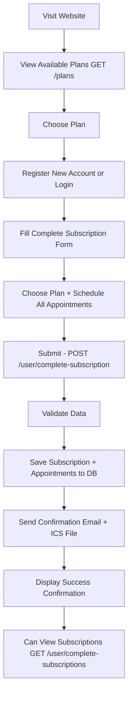
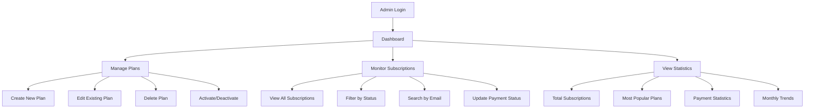

# 🎯 Appointment Booking System

Simple and direct appointment booking system - users choose a plan and book all appointments in a single form!

## 🚀 Technologies Used
- **Backend:** Node.js, Express.js
- **Database:** MongoDB with Mongoose
- **Authentication:** JWT Token
- **Email:** Nodemailer with ICS Calendar files
- **Validation:** Express Validator

## 📁 Simplified Project Structure
```
src/
├── controllers/
│   ├── subscriptionController.js      # User subscriptions
│   ├── adminSubscriptionController.js # Admin subscription management
│   ├── planController.js              # Plan management
│   ├── authController.js              # User authentication
│   ├── adminController.js             # Admin authentication
│   └── publicController.js            # Public plan display
├── models/
│   ├── subscriptionModel.js           # Subscription model
│   ├── planModel.js                   # Plan model
│   ├── userModel.js                   # User model
│   └── adminModel.js                  # Admin model
├── routes/
│   ├── userRoute.js                   # User routes (2 endpoints)
│   ├── adminRoute.js                  # Admin routes
│   ├── authRoute.js                   # Authentication routes
│   └── indexRoute.js                  # Main routes
└── utils/validators/
    ├── subscriptionValidators.js      # Subscription validation
    ├── planValidators.js              # Plan validation
    ├── authValidators.js              # Authentication validation
    └── adminValidators.js             # Admin data validation
```

## ⚙️ Environment Setup (.env)
```env
PORT=4000
NODE_ENV=development

# Database
MONGODB_URL=mongodb://localhost:27017/AppointmentBookingSystem

# JWT Configuration
JWT_SECRET_KEY=your_very_long_and_secure_secret_key_here

# Email Configuration
EMAIL_HOST=smtp.gmail.com
EMAIL_PORT=587
EMAIL_USER=your_email@gmail.com
EMAIL_PASSWORD=your_app_password
EMAIL_FROM="Appointment Booking <your_email@gmail.com>"
```

## 🏃‍♂️ Running the Project
```bash
# Development
npm run start:dev

# Production
npm run start:prod
```

## 🎯 Simplified System

### For Regular Users:
1. **View available plans** (no login required)
2. **Register new account** or login
3. **Fill out one form only** - choose plan + all appointments
4. **Receive confirmation email** with calendar file
5. **View their subscriptions**

### For Admin:
1. **Create and manage plans**
2. **Monitor all subscriptions**
3. **View statistics**

---

## 📋 API Endpoints

### 🔓 Public (no login required)
```http
GET /api/v1/plans
```
Display all available plans for selection

**Response:**
```json
{
  "status": "SUCCESS",
  "results": 3,
  "data": {
    "plans": [
      {
        "_id": "674b123...",
        "name": "Basic Plan",
        "description": "4 sessions per month",
        "sessionsPerMonth": 4,
        "sessionsPerWeek": 2,
        "price": 500,
        "currency": "EGP",
        "duration": 30
      }
    ]
  }
}
```

---

## 👤 Regular User

### 1. Authentication
```http
POST /api/v1/auth/register
Content-Type: application/json

{
  "name": "Ahmed Mohamed",
  "email": "ahmed@example.com",
  "password": "password123"
}
```

```http
POST /api/v1/auth/login
Content-Type: application/json

{
  "email": "ahmed@example.com",
  "password": "password123"
}
```

**Response:**
```json
{
  "status": "SUCCESS",
  "message": "Login successful",
  "data": {
    "token": "eyJhbGciOiJIUzI1NiIsInR5cCI6IkpXVCJ9...",
    "user": {
      "id": "674b...",
      "name": "Ahmed Mohamed",
      "email": "ahmed@example.com"
    }
  }
}
```

### 2. Create Complete Subscription (The Only Form)
```http
POST /api/v1/user/complete-subscription
Authorization: Bearer YOUR_TOKEN
Content-Type: application/json

{
  "subscriptionPlanId": "674b1234567890abcdef1234",
  "startDate": "2025-01-15",
  "sessions": [
    {
      "date": "2025-01-15",
      "time": "14:30",
      "notes": "First session"
    },
    {
      "date": "2025-01-17",
      "time": "16:00",
      "notes": "Second session"
    },
    {
      "date": "2025-01-22",
      "time": "14:30"
    },
    {
      "date": "2025-01-24",
      "time": "16:00"
    }
  ]
}
```

**Response:**
```json
{
  "status": "SUCCESS",
  "message": "Subscription created successfully with all appointments",
  "data": {
    "subscription": {
      "id": "674b5678901234567890abcd",
      "planName": "Basic Plan",
      "planPrice": 500,
      "planCurrency": "EGP",
      "startDate": "2025-01-15T00:00:00.000Z",
      "endDate": "2025-02-14T00:00:00.000Z",
      "totalSessions": 4,
      "sessionsScheduled": 4,
      "status": "confirmed",
      "nextSession": {
        "date": "2025-01-15",
        "time": "14:30",
        "startsAt": "2025-01-15T14:30:00.000Z"
      },
      "sessions": [
        {
          "id": "674b567890123456789",
          "date": "2025-01-15",
          "time": "14:30",
          "startsAt": "2025-01-15T14:30:00.000Z",
          "status": "scheduled",
          "notes": "First session"
        }
        // Rest of sessions...
      ]
    }
  }
}
```

### 3. View User Subscriptions
```http
GET /api/v1/user/complete-subscriptions
Authorization: Bearer YOUR_TOKEN
```

**Response:**
```json
{
  "status": "SUCCESS",
  "results": 2,
  "data": {
    "subscriptions": [
      {
        "id": "674b5678901234567890abcd",
        "planName": "Basic Plan",
        "planPrice": 500,
        "planCurrency": "EGP",
        "startDate": "2025-01-15T00:00:00.000Z",
        "endDate": "2025-02-14T00:00:00.000Z",
        "totalSessions": 4,
        "sessionsCompleted": 1,
        "sessionsRemaining": 3,
        "status": "confirmed",
        "nextSession": {
          "date": "2025-01-17",
          "time": "16:00"
        },
        "createdAt": "2025-01-10T10:30:00.000Z",
        "sessions": [
          // All sessions with details
        ]
      }
    ]
  }
}
```

---

## 👑 Admin

### 1. Admin Login
```http
POST /api/v1/admin/login
Content-Type: application/json

{
  "email": "admin@example.com",
  "password": "admin123"
}
```

### 2. Create New Plan
```http
POST /api/v1/admin/subscription-plans
Authorization: Bearer ADMIN_TOKEN
Content-Type: application/json

{
  "name": "Premium Plan",
  "description": "8 sessions per month with additional features",
  "sessionsPerMonth": 8,
  "sessionsPerWeek": 3,
  "price": 1000,
  "currency": "EGP",
  "features": ["Individual sessions", "Personal follow-up", "Weekly reports"],
  "duration": 30
}
```

### 3. View All Plans
```http
GET /api/v1/admin/subscription-plans
Authorization: Bearer ADMIN_TOKEN
```

### 4. View All Subscriptions
```http
GET /api/v1/admin/complete-subscriptions
Authorization: Bearer ADMIN_TOKEN

# With optional filters:
GET /api/v1/admin/complete-subscriptions?status=confirmed&userEmail=ahmed@example.com&page=1&limit=10
```

### 5. Comprehensive Statistics
```http
GET /api/v1/admin/complete-subscriptions/stats
Authorization: Bearer ADMIN_TOKEN
```

**Response:**
```json
{
  "status": "SUCCESS",
  "data": {
    "totalSubscriptions": 150,
    "statusBreakdown": [
      { "_id": "confirmed", "count": 80 },
      { "_id": "active", "count": 45 },
      { "_id": "completed", "count": 25 }
    ],
    "paymentBreakdown": [
      { "_id": "paid", "count": 120, "totalRevenue": 75000 },
      { "_id": "pending", "count": 30, "totalRevenue": 15000 }
    ],
    "popularPlans": [
      { "_id": "Basic Plan", "count": 90, "totalRevenue": 45000 },
      { "_id": "Premium Plan", "count": 60, "totalRevenue": 60000 }
    ],
    "monthlyTrends": [
      { "_id": { "year": 2025, "month": 1 }, "count": 25, "revenue": 15000 }
    ]
  }
}
```

---

## 🎯 User Flow (Regular User)



## 🛠️ Admin Flow



---

## ✅ System Features

### 🎯 **For Users:**
- **One form only** - choose plan and book all appointments at once
- **No complications** - no editing or canceling appointments
- **Instant confirmation** - confirmation email with calendar file (ICS)
- **Full transparency** - view all subscriptions and appointments

### 🛠️ **For Admin:**
- **Comprehensive management** - create and edit plans
- **Continuous monitoring** - all subscriptions and appointments
- **Detailed statistics** - comprehensive numbers and reports
- **Advanced filters** - search and filter by different criteria

### 🔧 **Technically:**
- **Single database** - each subscription in one document
- **Automatic validation** - of appointment validity and limits
- **High security** - JWT authentication and comprehensive validation
- **Excellent performance** - simplified and efficient structure

---

## 🚀 Getting Started

### 1. Project Setup:
```bash
git clone https://github.com/your-repo/appointment-booking.git
cd appointment-booking
npm install
```

### 2. Environment Setup:
- Copy `.env.example` to `.env`
- Fill in required environment variables

### 3. Run Project:
```bash
npm run start:dev
```

### 4. Test API:
```bash
# View plans
curl http://localhost:4000/api/v1/plans

# Register new user
curl -X POST http://localhost:4000/api/v1/auth/register \
  -H "Content-Type: application/json" \
  -d '{"name":"Ahmed","email":"ahmed@example.com","password":"123456"}'
```

---

## 🧪 Testing Examples

### Register New User:
```bash
curl -X POST http://localhost:4000/api/v1/auth/register \
  -H "Content-Type: application/json" \
  -d '{
    "name": "Ahmed Mohamed",
    "email": "ahmed@example.com",
    "password": "password123"
  }'
```

### Create Complete Subscription:
```bash
curl -X POST http://localhost:4000/api/v1/user/complete-subscription \
  -H "Content-Type: application/json" \
  -H "Authorization: Bearer YOUR_TOKEN" \
  -d '{
    "subscriptionPlanId": "674b1234567890abcdef1234",
    "startDate": "2025-01-15",
    "sessions": [
      {
        "date": "2025-01-15",
        "time": "14:30",
        "notes": "First session"
      },
      {
        "date": "2025-01-17",
        "time": "16:00"
      },
      {
        "date": "2025-01-22",
        "time": "14:30"
      },
      {
        "date": "2025-01-24",
        "time": "16:00"
      }
    ]
  }'
```

### View User Subscriptions:
```bash
curl -X GET http://localhost:4000/api/v1/user/complete-subscriptions \
  -H "Authorization: Bearer YOUR_TOKEN"
```

### For Admin - Create New Plan:
```bash
curl -X POST http://localhost:4000/api/v1/admin/subscription-plans \
  -H "Content-Type: application/json" \
  -H "Authorization: Bearer ADMIN_TOKEN" \
  -d '{
    "name": "Premium Plan",
    "description": "8 sessions per month",
    "sessionsPerMonth": 8,
    "sessionsPerWeek": 3,
    "price": 1000,
    "currency": "EGP"
  }'
```

---

## 📊 Data Models

### Subscription
```javascript
{
  user: ObjectId,              // User
  userEmail: String,           // User email
  subscriptionPlan: ObjectId,  // Selected plan
  planName: String,            // Plan name
  planPrice: Number,           // Plan price
  planCurrency: String,        // Currency
  startDate: Date,             // Start date
  endDate: Date,               // End date
  totalSessions: Number,       // Total sessions
  sessions: [                  // All sessions
    {
      date: String,            // "2025-01-15"
      time: String,            // "14:30"
      startsAt: Date,          // Session date and time
      status: String,          // scheduled/completed/cancelled
      notes: String            // Notes
    }
  ],
  status: String,              // confirmed/active/completed
  paymentStatus: String,       // pending/paid/failed
  createdAt: Date,
  updatedAt: Date
}
```

### Plan
```javascript
{
  name: String,                // Plan name
  description: String,         // Plan description
  sessionsPerMonth: Number,    // Sessions per month
  sessionsPerWeek: Number,     // Weekly limit
  price: Number,               // Price
  currency: String,            // Currency (EGP/USD/EUR)
  duration: Number,            // Subscription duration in days
  features: [String],          // Features
  isActive: Boolean,           // Active or not
  createdBy: ObjectId,         // Admin who created the plan
  createdAt: Date,
  updatedAt: Date
}
```

---

## 🔐 Security and Authentication

### JWT Token:
- Token is generated upon login
- Token valid for 7 days by default
- Must send Token in header: `Authorization: Bearer YOUR_TOKEN`

### Validation:
- All inputs are validated using express-validator
- Validation of dates and times
- Prevent appointment conflicts and check limits

### Error Handling:
- Clear and helpful error messages
- Correct HTTP status codes
- Server error logging

---

## 📞 Support and Help

- **Developer:** Abdullah Abdellatif
- **Email:** abdallateefshohdy0190@gmail.com
- **GitHub:** [abdallateef-sa](https://github.com/abdallateef-sa)

---

## 📄 License

This project is licensed under the MIT License - see the [LICENSE](LICENSE) file for details.
